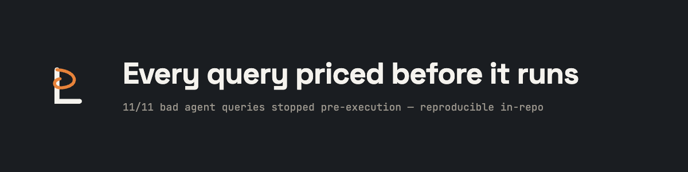
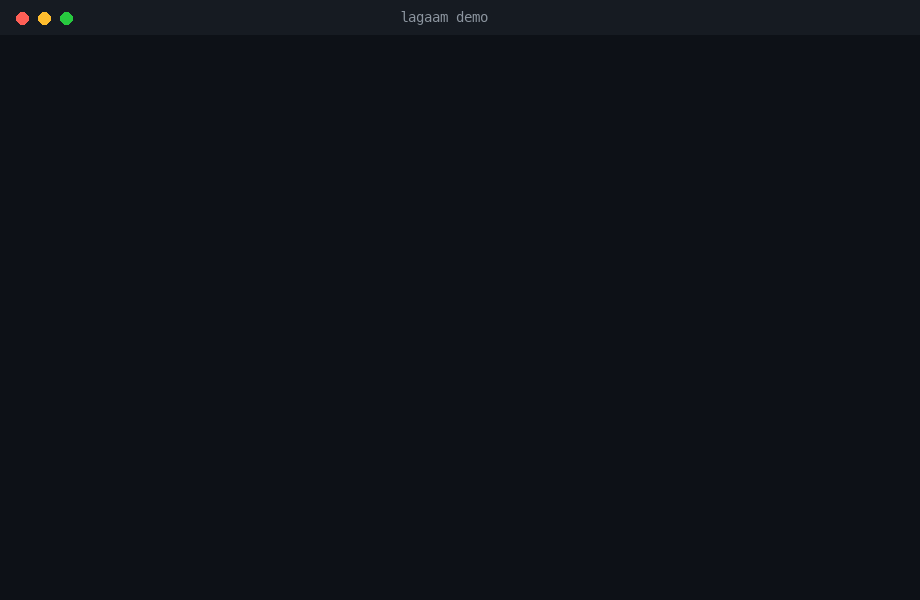
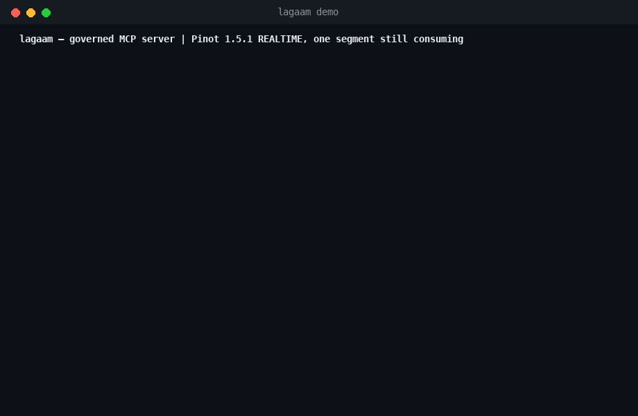

**Stop your agent from running the $500 query.** Lagaam is a governed MCP
server that sits between your AI agents and your lakehouse (Trino and
Apache Pinot). Every query is schema-grounded, priced *before* it runs,
checked against a budget, and audited — and every rejection tells the agent
exactly how to fix its SQL.



*Real session, real Trino, nothing mocked — reproduce it with
`uv run --project server python examples/demo.py`.*



*Real session, real Pinot 1.5.1 realtime table, nothing mocked — reproduce it
with `uv run --project server python examples/demo_pinot.py`.*

## The problem

Agents write syntactically-valid, catastrophic SQL. A missing partition
filter turns into a full scan over a petabyte table; one retry loop burns a
day's warehouse budget in minutes; a `SELECT *` drags 40 columns into a
context window that needed 2. The usual fix is to not give agents database
access at all.

Lagaam gives them access with reins on:

- **Cost is a quotation, not a bill.** Every query is priced from the
  engine's own plan before execution — `EXPLAIN (TYPE IO)` for the bytes it
  would scan, `EXPLAIN (TYPE LOGICAL)` for the widest row count any operator
  would build (the number a cross join blows and a `LIMIT` cannot hide).
  Over budget → blocked, with the number and the fix.
- **Un-estimable means no.** No table statistics, a self-join that breaks
  the estimate, a passthrough the planner can't see — the gate fails safe
  instead of hoping.
- **Read-only, enforced in the AST.** Single `SELECT` only. No DDL/DML, no
  multi-statement injection, no `SELECT *`, no table-function passthrough,
  and a `LIMIT` is injected when missing. Validated SQL is re-rendered, so
  what runs is exactly what was checked.
- **Agents ground themselves.** `list_catalogs` and `describe_table` return
  exact names, types, and row estimates — scoped to the agent's table grant,
  so the agent never learns names it isn't allowed to touch.
- **Results are verified before they're trusted.** Zero rows, truncated
  pages, all-NULL columns — the agent gets a warning with a next action, not
  a silently misleading answer.
- **Every call is audited.** One JSONL line per tool call: who, what,
  allowed or denied, and why.

## Catch rate

11 queries an LLM agent plausibly writes — full scans, `SELECT *`, DDL,
injection attempts, oversized joins, out-of-grant reads. A raw MCP
wrapper submits all of them to the engine. Lagaam stops **11/11 before
execution** while the well-scoped control query runs untouched.
Reproduce: [`benchmarks/catch_rate.py`](benchmarks/catch_rate.py) →
[results](benchmarks/results.md).

## Quickstart

```bash
git clone https://github.com/lagaam-ai/lagaam && cd lagaam
docker compose -f examples/docker-compose.yml --profile trino up -d   # demo warehouse
cd server && uv sync
LAGAAM_ALLOWED_TABLES=tpch.tiny.orders,tpch.tiny.lineitem \
  uv run python -m lagaam                                             # MCP server on stdio
```

Or point it at the Trino you already have with `TRINO_HOST` / `TRINO_PORT` /
`TRINO_USER`.

For Pinot, `--profile pinot` brings up the batch quickstart and
`--profile pinot-realtime up -d` brings up a Kafka-fed streaming one —
run `examples/pinot-realtime/bootstrap.sh` after it to create the topics,
tables and feed. Then start the server with `LAGAAM_ENGINE=pinot`.

Wire it into any MCP client (Claude Code, Claude Desktop, or your own agent):

```json
{
  "mcpServers": {
    "lagaam": {
      "command": "uv",
      "args": ["run", "--project", "/path/to/lagaam/server", "python", "-m", "lagaam"],
      "env": {
        "TRINO_HOST": "localhost",
        "LAGAAM_MAX_SCAN_BYTES": "5368709120",
        "LAGAAM_ALLOWED_TABLES": "hive.sales.orders,hive.sales.customers"
      }
    }
  }
}
```

The agent gets three tools — `list_catalogs`, `describe_table`,
`query_data` — and cannot reach the engine any other way.

## Configuration

| Env var | Meaning | Default |
|---|---|---|
| `LAGAAM_ALLOWED_TABLES` | Comma list of `catalog.schema.table` grants | **required** |
| `LAGAAM_ALLOW_ALL_TABLES` | `true` to run with no grant at all | off |
| `LAGAAM_AGENT_NAME` | Identity stamped on the audit trail | `anonymous` |
| `LAGAAM_MAX_SCAN_BYTES` | Scan-bytes budget per query, pre-execution | 50 GiB |
| `LAGAAM_MAX_ROWS` | Scanned-row estimate budget per query | ungated |
| `LAGAAM_MAX_INTERMEDIATE_ROWS` | Rows the engine would *build* at its widest step — not rows returned, so a `LIMIT` doesn't lower it | 50,000,000 |
| `LAGAAM_MAX_RETURNED_ROWS` | Rows returned to the agent per query — unset, the server applies its own 1000-row cap, and a bigger `LIMIT` in the query is lowered to it before it runs | `1000` (max `100000`) |
| `LAGAAM_QUERY_TIMEOUT` | Wall-clock seconds per query | `300` |
| `LAGAAM_METADATA_TTL` | Metadata cache TTL, seconds | `300` |
| `LAGAAM_AUDIT_LOG` | Audit JSONL file path | stderr |
| `TRINO_HOST` / `TRINO_PORT` / `TRINO_USER` | Trino coordinator | `localhost` / `8080` / `lagaam` |

**The server will not start without `LAGAAM_ALLOWED_TABLES`.** An agent that
can reach every table in every catalog is the thing this exists to prevent, so
that has to be asked for — set `LAGAAM_ALLOW_ALL_TABLES=true` if you mean it.

**The budget dimensions above apply whether or not you set them.** Leaving
`LAGAAM_MAX_SCAN_BYTES` and `LAGAAM_MAX_INTERMEDIATE_ROWS` unset gives you
their defaults, not an open gate — an unconfigured server refuses what it
cannot afford rather than waving it through. If queries are being denied and
you expected no limits, that is why; raise the dimension you mean to raise.

Cost quotes come from the engine's own plan estimates, and those need table
statistics: a table without stats cannot be priced, so its queries are refused
rather than guessed at. Run `ANALYZE` on your tables before pointing an agent
at them — a connector that has no statistics at all is effectively unusable
through the gate. That is deliberate: a query nobody can size is exactly the
kind that runs for $500.

## How it works

A `QueryEngine` port with a Trino adapter and a native Pinot adapter —
grounding, execution, and a synthesised cost quotation for both OFFLINE and
REALTIME tables. Every `query_data` call walks one pipeline: **validate
(sqlglot AST) → table allowlist → cost quotation → budget gate → execute
(row cap + timeout) → verify → audit**.

On Trino, the quote is the engine's own plan, not a guess from the SQL text:
`EXPLAIN (TYPE IO)` prices the bytes a query would scan, and
`EXPLAIN (TYPE LOGICAL)` prices the widest row count any operator would
build — the number a cross join blows and a `LIMIT` cannot hide.

Pinot gives no such plan — every table scan reports the same placeholder
row count whatever the table holds, and no endpoint reports bytes at all —
so its quote is synthesised instead: from static segment metadata, the
broker's own pruning oracle (how many segments survive the predicate), and
the plan's join/union shape. A consuming (REALTIME) segment, which the
controller reports as empty mid-flight, is priced at the stream's own flush
threshold instead of zero. A join is charged its bound rather than the
product wherever the catalog can prove the join key. See
[ADR 0008](docs/adr/0008-pinot-quotation-is-adapter-synthesised.md) and
[ADR 0009](docs/adr/0009-consuming-segments-and-proven-join-keys.md).

Details in [docs/architecture.md](docs/architecture.md); the longer story in
[docs/vision.md](docs/vision.md).

## Status

`v0.2.0` — Trino adapter, schema tools, plan-based cost guard, query
budgets, read-only enforcement, per-agent allowlists, result verification,
audit log. 1,031 unit + 146 integration tests (live Trino 476 and Pinot
1.5.1, batch and realtime), mypy strict. `LAGAAM_ENGINE=pinot` starts the
native Pinot adapter: grounding, execution and a quotation synthesised from
segment metadata and the broker's own pruning oracle, for OFFLINE and
REALTIME tables alike — a consuming segment is charged at the stream's
flush threshold, and a join is charged its bound rather than the product
wherever the catalog proves the key. On deck
([roadmap](docs/roadmap.md)): post-execution actuals on the audit line,
then a Kubernetes control plane — agents as CRDs with token/dollar budgets
and kill switches.

Apache 2.0.
