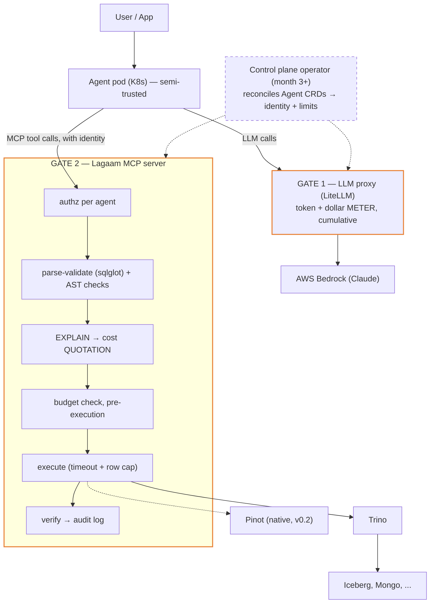

# Architecture

## System shape



Control plane (operator) is out-of-band: it reconciles Agent CRDs into pods,
identities, and limit configs that the two gates read. It never sits in the
data path.

## The two cost gates (core mental model)
| | Token cost | Query cost |
|---|---|---|
| Nature | unpredictable per call | predictable per query |
| Mechanism | METER — count after, cumulative | QUOTATION — estimate before |
| Enforced at | LLM proxy | MCP server, pre-execution |
| Source of limits | Agent CRD (tokens/$ per day) | Agent CRD (scan GB, rows, timeout) |

Enforcement never lives in the agent pod: the pod runs LLM-driven logic and
must be treated as injectable/semi-trusted. Gates are outside it.

## QueryEngine port (hexagonal core)
```python
class QueryEngine(Protocol):
    def list_catalogs(self) -> CatalogMetadata: ...
    def describe_table(self, catalog: str, table: str) -> TableSchema: ...
    def explain(self, sql: str) -> QueryPlan: ...
    def estimate_cost(self, plan: QueryPlan) -> CostEstimate: ...
    def execute(self, sql: str, budget: QueryBudget) -> QueryResult: ...
    def dialect(self) -> DialectCard: ...
```
- Core depends only on this protocol. Adapters implement it.
- `CostEstimate` carries a confidence level: Trino EXPLAIN gives rich
  estimates; Pinot adapter will use segment-metadata heuristics.
- `DialectCard` = structured summary of the engine's SQL dialect (functions,
  quirks, unsupported features) injected into the generation prompt.
  Primary dialect strategy is generate-in-target-dialect; sqlglot transpile
  is fallback/validation only.

## SQL safety pipeline (order matters — cheap checks first)
1. sqlglot parse → reject unparseable (no engine round-trip wasted)
2. AST checks → read-only only, LIMIT present, no `SELECT *`, no DDL/DML
3. EXPLAIN → cost estimate vs agent's query budget
4. Execute with server-side timeout + row cap
5. Verify → sanity checks on result shape; optional self-correction loop
6. Audit log → agent identity, SQL, cost estimate vs actual, timestamp

## Identity flow
Operator creates agent pod → issues identity (service account / token) →
MCP server maps identity → permission set (schemas/tables allowlist) and
budgets. v1 transport: bearer token per agent, config in a shared store the
operator writes and the server watches. SPIFFE/OAuth-for-agents revisited
post-v1 as standards mature.

## Local development
- Trino: single Docker container, TPC-H catalog for instant test data.
- Pinot: official quickstart image (v0.2).
- kind for operator work (month 3+).
- Docker Compose profiles so only the needed engine runs.
- LLM: Bedrock via LiteLLM; Ollama profile for offline mock runs.
