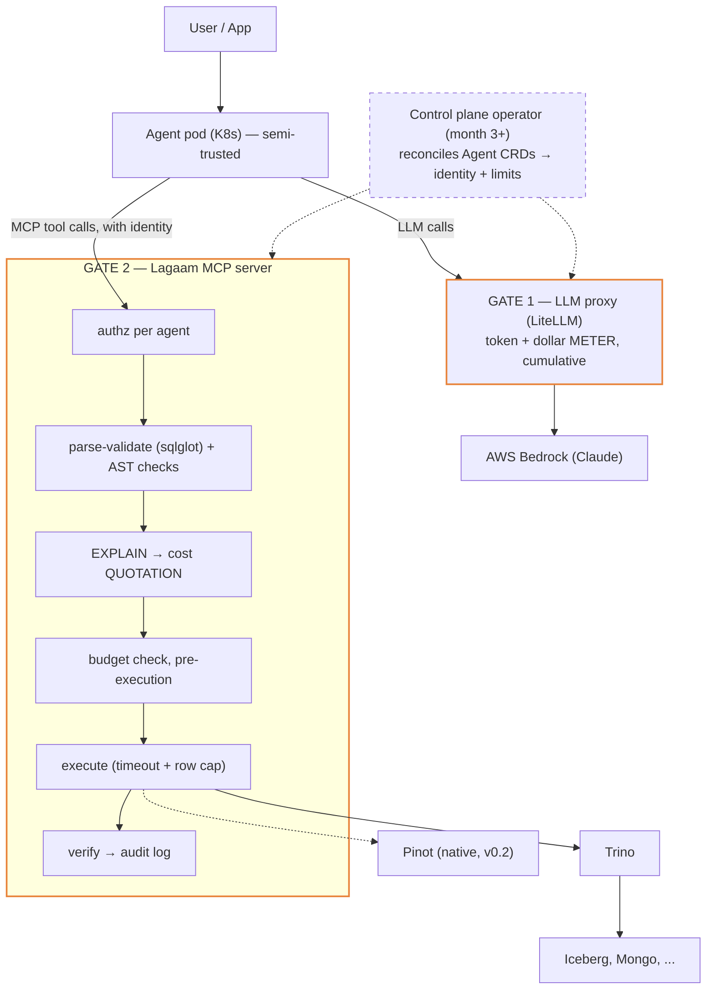

# Architecture

## System shape



Control plane (operator) is out-of-band: it reconciles Agent CRDs into pods,
identities, and limit configs that the two gates read. It never sits in the
data path.

## The two cost gates (core mental model)
| | Token cost | Query cost |
|---|---|---|
| Nature | unpredictable per call | predictable per query |
| Mechanism | METER — count after, cumulative | QUOTATION — estimate before |
| Enforced at | LLM proxy | MCP server, pre-execution |
| Source of limits | Agent CRD (tokens/$ per day) | Agent CRD (scan GB, rows, timeout) |

Enforcement never lives in the agent pod: the pod runs LLM-driven logic and
must be treated as injectable/semi-trusted. Gates are outside it.

## QueryEngine port (hexagonal core)
```python
class QueryEngine(Protocol):
    def list_catalogs(self) -> CatalogMetadata: ...
    def describe_table(self, catalog: str, table: str) -> TableSchema: ...
    def explain(self, sql: str) -> QueryPlan: ...
    def estimate_cost(self, plan: QueryPlan) -> CostEstimate: ...
    def execute(self, sql: str, budget: QueryBudget) -> QueryResult: ...
    def dialect(self) -> DialectCard: ...
```
- Core depends only on this protocol. Adapters implement it.
- `CostEstimate` carries a confidence level: Trino EXPLAIN gives rich
  estimates; Pinot adapter will use segment-metadata heuristics.
- `DialectCard` = structured summary of the engine's SQL dialect (functions,
  quirks, unsupported features) injected into the generation prompt.
  Primary dialect strategy is generate-in-target-dialect; sqlglot transpile
  is fallback/validation only.

## SQL safety pipeline (order matters — cheap checks first)
1. sqlglot parse → reject unparseable (no engine round-trip wasted)
2. AST checks → read-only only, LIMIT present, no `SELECT *`, no DDL/DML
3. Two EXPLAIN calls → byte + widest-row quote vs the agent's budget
   (mechanism in the next section)
4. Execute with server-side timeout + row cap
5. Verify → sanity checks on result shape; optional self-correction loop
6. Audit log → agent identity, SQL, cost estimate vs actual, timestamp

Engine errors at step 4 come back with a hint naming what to change:
`NOT_SUPPORTED` and `FUNCTION_NOT_FOUND` tell the agent which construct or
function to rewrite, instead of inviting it to retry the identical query.

## Cost quotation (how a query is priced)

Two EXPLAIN calls per query, both planning-only (~30 ms each, nothing
executes):

| Call | Yields |
|---|---|
| `EXPLAIN (TYPE IO, FORMAT JSON)` | bytes the query would scan, per table |
| `EXPLAIN (TYPE LOGICAL, FORMAT JSON)` | `outputRowCount` for every plan operator |

The row quote is the **maximum `outputRowCount` over every operator in the
plan** — the widest intermediate the query would build — gated by
`LAGAAM_MAX_INTERMEDIATE_ROWS`. The byte quote comes from the IO plan, which
reports one entry per table however often the query reads it, so the bytes
are scaled by the repeat count (a 3-way self-join would otherwise price as a
single scan); the logical plan's per-operator rows already account for
repeated reads, so the row number is used unscaled.

### Why the widest intermediate, not the output count

The output count is trivially launderable. Measured on Trino 476 (`tpch`): a
902,625,000-row cross join reports 10 output rows under `LIMIT 10`, 1 under
`count(*)`, and 15,000 under `DISTINCT` or `GROUP BY` — while doing the full
902M rows of work either way. The per-operator maximum reports 902,625,000
for every one of those rewrites.

### Why the plan, not the SQL text

The previous gate parsed the SQL and tested shape heuristics — does a join
have an equality, is a GROUP BY single-keyed, is an inline relation small.
Every such rule had a counterexample, because cardinality is a property of
the data, not of the syntax. The canonical one:
`JOIN orders o ON l.linestatus = o.orderstatus` is a plain equi-join on bare
columns that breaks no shape rule, and Trino plans it at 300,875,000 rows —
the join key has two distinct values. The engine's cost-based optimizer
already knows that; the gate now asks it instead of guessing.

### Unknown estimates (NaN)

Opaque filters (`LIKE '%x%'`), window functions, and scalar subqueries null
Trino's estimates, and the unknown propagates up the plan. Two rules:

- A NaN join **without** equality criteria is charged the **product of its
  children's known rows**. That is what catches a cross join laundered
  behind a `LIKE '%x%'` filter, which nulls the join's own estimate.
- A NaN join **with** equality criteria takes the **max of its children**
  instead: Trino sometimes fails to propagate stats through a decorrelated
  correlated subquery, and charging the product there invented 12 billion
  rows for a query that really touches 10,000.

### The one thing the plan cannot see: row generators

`UNNEST(sequence(1, 10000))` manufactures rows from an argument, not from a
table: over a 60,175-row table it plans as 60,175 rows and produces 601
million. Generator detection therefore stays a SQL-level AST check in
`core/scans.py` — the only shape analysis left there. A query it flags gets
no quote at all (confidence "low"), which the budget denies with
what-to-change text.

### Fail safe, and the statistics requirement

A gated dimension the quote cannot measure is a denial, never a pass. The
consequence: a table or catalog without statistics cannot be priced, so its
queries are refused. Verified on Trino 476: the built-in `tpch` connector
has no statistics at `sf100` (`SHOW STATS` returns NULL for every column,
even the 25-row `nation` table), so sf100-scale queries are denied until
stats exist. Run `ANALYZE` on your tables; a connector with no statistics at
all is effectively unusable through the gate.

### Picking `LAGAAM_MAX_INTERMEDIATE_ROWS`

Measured on Trino 476 (`tpch`): legitimate analytics peaks at 6,001,215 rows
at sf1 scale (a plain `lineitem JOIN orders`), while the cheapest measured
explosion is 225,000,000 at any scale. The default of 50,000,000 sits
between — 8.3x above real sf1 work, 4.5x below the cheapest attack.
Operators at larger scale should raise it; the bands above are the ruler.

## Identity flow
Operator creates agent pod → issues identity (service account / token) →
MCP server maps identity → permission set (schemas/tables allowlist) and
budgets. v1 transport: bearer token per agent, config in a shared store the
operator writes and the server watches. SPIFFE/OAuth-for-agents revisited
post-v1 as standards mature.

## Local development
- Trino: single Docker container, TPC-H catalog for instant test data.
- Pinot: official quickstart image (v0.2).
- kind for operator work (month 3+).
- Docker Compose profiles so only the needed engine runs.
- LLM: Bedrock via LiteLLM; Ollama profile for offline mock runs.
